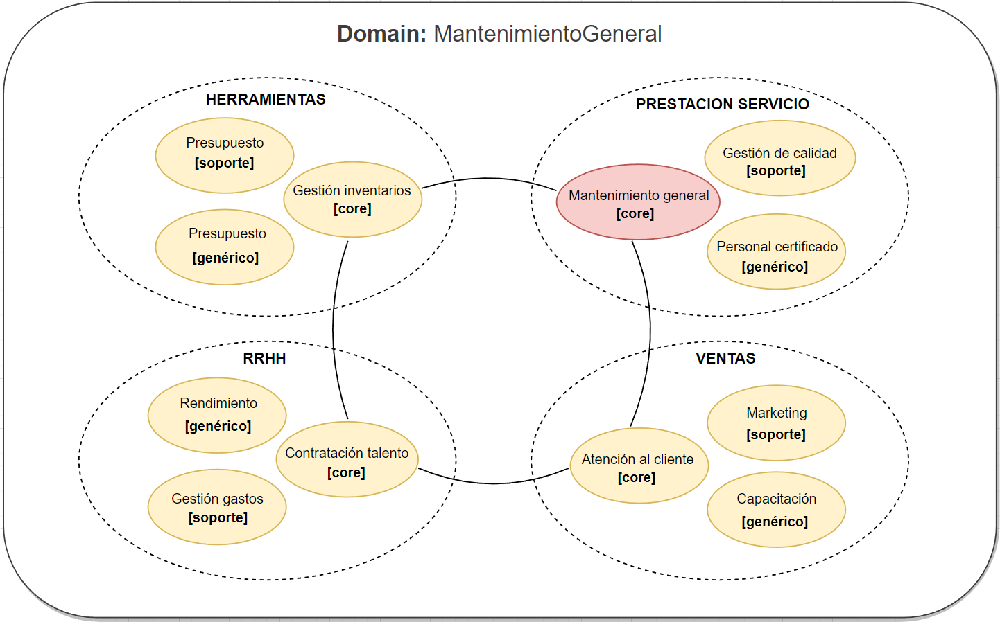
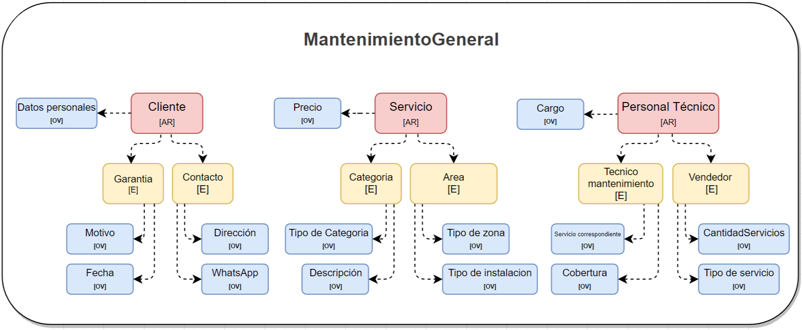
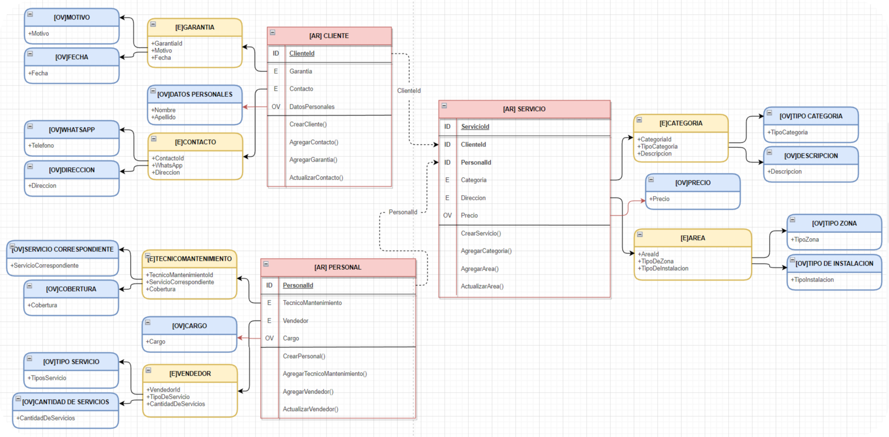
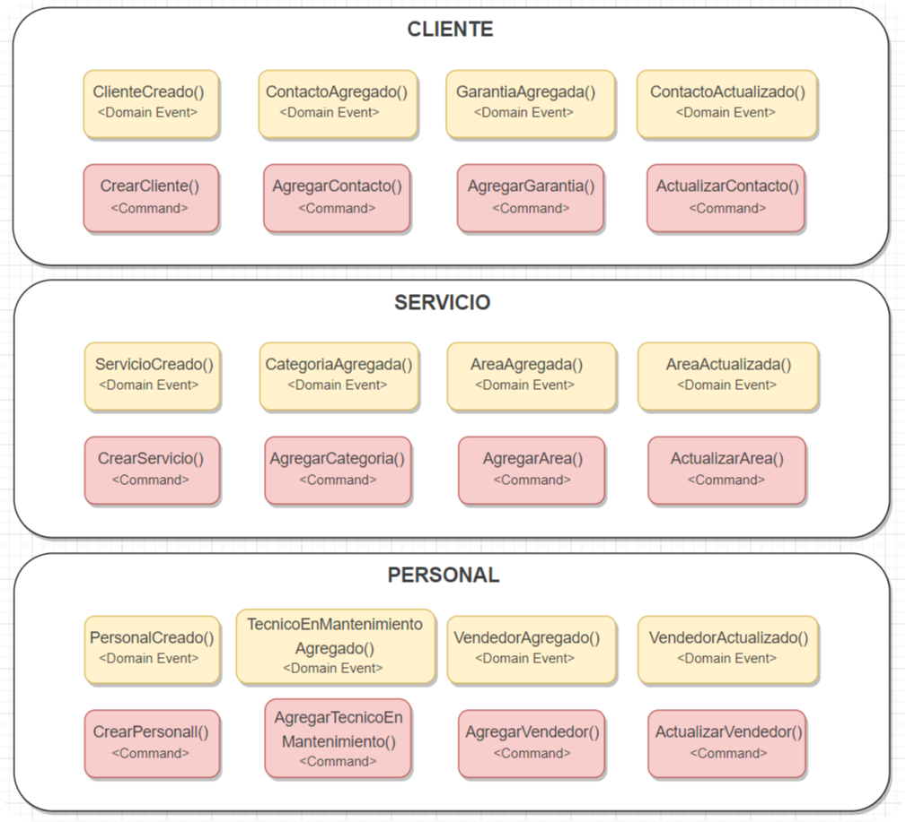

# __Servicios de mantenimiento__

## Datos de Presentación

- Fecha: `21 de Agosto del 2022`
- Autor: `Juan Camilo Castañeda Castro`

## Objetivos del Proyecto

- Este proyecto esta basado bajo el marco de trabajo DDD(Domain Driven Desing) donde se hace un analisis sobre la necesidad puntual del negocio y a partir de alli crear un modelo de trabajo con una arquitectura limpia y lenguaje ubicuo.
- Implementar los comportamientos necesarios para identificar las partes fundamentales del negocio.
- Realizacion de casos de uso y test por cada comportamiento.

## __Análisis (Contextos y subdominios)__

 

  

## __Análisis subdominio core (Mantenimiento general)__

 

  

## __Modelo de dominio__

 

  

## __Eventos de dominio__

 

  

__IMPORTANTE:__

Es necesario contar mínimamente con la última versión estable de Java 18 y maven. Asegurarse de contar con ella para poder instalar correctamente las dependencias necesarias para correr el proyecto.

